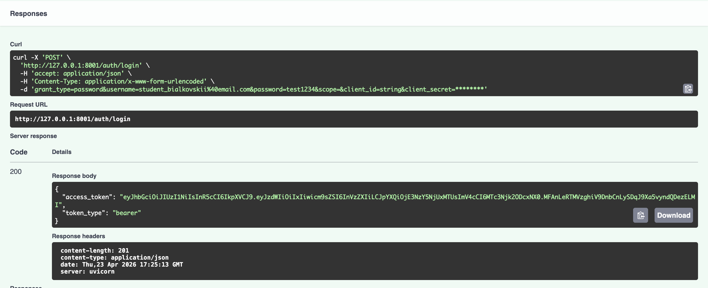

# LLM API Project

FastAPI-проект с JWT-аутентификацией, SQLite и интеграцией с OpenRouter. Приложение позволяет зарегистрировать пользователя, получить токен доступа, отправлять сообщения в LLM, хранить историю переписки и очищать её через API.

## Что умеет

- Регистрация и авторизация пользователя
- Получение профиля текущего пользователя
- Отправка сообщений в LLM через OpenRouter
- Хранение истории чата в SQLite
- Просмотр и удаление истории сообщений

## Стек

- Python 3.11+
- FastAPI
- SQLAlchemy
- SQLite
- Pydantic
- JWT
- OpenRouter API
- Uvicorn

## Структура API

- `POST /auth/register` - регистрация нового пользователя
- `POST /auth/login` - вход и получение `access_token`
- `GET /auth/me` - профиль текущего пользователя
- `POST /chat` - отправка запроса в модель
- `GET /chat/history` - получение истории переписки
- `DELETE /chat/history` - удаление истории переписки
- `GET /health` - проверка состояния сервиса

## Переменные окружения

Перед запуском нужно создать файл `.env`. Удобнее всего взять за основу `.env.example`:

```bash
cp .env.example .env
```

Приложение использует следующие параметры:

- `APP_NAME`
- `ENV`
- `JWT_SECRET`
- `JWT_ALG`
- `ACCESS_TOKEN_EXPIRE_MINUTES`
- `SQLITE_PATH`
- `OPENROUTER_API_KEY`
- `OPENROUTER_BASE_URL`
- `OPENROUTER_MODEL`
- `OPENROUTER_SITE_URL`
- `OPENROUTER_APP_NAME`

## Запуск

Создание виртуального окружения через `uv`:

```bash
uv venv
```

Активация окружения:

```bash
source .venv/bin/activate
```

Компиляция зависимостей из `pyproject.toml`:

```bash
uv pip compile pyproject.toml -o requirements.txt
```

Установка зависимостей:

```bash
uv pip install -r requirements.txt
```

Запуск сервера:

```bash
uv run uvicorn app.main:app --reload
```

После запуска API будет доступно по адресу:

```text
http://127.0.0.1:8000
```

Swagger UI:

```text
http://127.0.0.1:8000/docs
```

Если не хочется использовать `requirements.txt`, проект также запускается через короткий вариант:

```bash
uv sync
uv run uvicorn app.main:app --reload
```

## Как работает сценарий

1. Пользователь регистрируется через `/auth/register`.
2. Затем входит через `/auth/login` и получает Bearer-токен.
3. С этим токеном отправляет запрос на `/chat`.
4. Сообщения сохраняются в базе, а историю можно получить через `/chat/history`.
5. Историю можно полностью очистить через `DELETE /chat/history`.

## Скриншоты

### Registration


### Login



### Auth


### Chat


### Hist


### Delete


### Deleted


